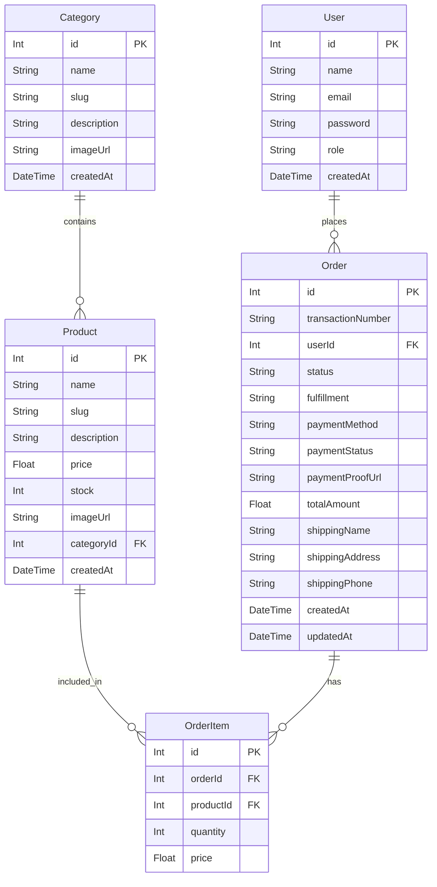

# ERD Sistem TahuBakso

Berikut adalah desain ERD sistem Anda berdasarkan `schema.prisma` saat ini.

```mermaid
erDiagram
    User ||--o{ Order : places
    Category ||--o{ Product : contains
    Product ||--o{ OrderItem : included_in
    Order ||--o{ OrderItem : has

    User {
        Int id PK
        String name
        String email
        String password
        String role
        DateTime createdAt
    }

    Category {
        Int id PK
        String name
        String slug
        String description
        String imageUrl
        DateTime createdAt
    }

    Product {
        Int id PK
        String name
        String slug
        String description
        Float price
        Int stock
        String imageUrl
        Int categoryId FK
        DateTime createdAt
    }

    Order {
        Int id PK
        String transactionNumber
        Int userId FK
        String status
        String fulfillment
        String paymentMethod
        String paymentStatus
        String paymentProofUrl
        Float totalAmount
        String shippingName
        String shippingAddress
        String shippingPhone
        DateTime createdAt
        DateTime updatedAt
    }

    OrderItem {
        Int id PK
        Int orderId FK
        Int productId FK
        Int quantity
        Float price
    }
```
